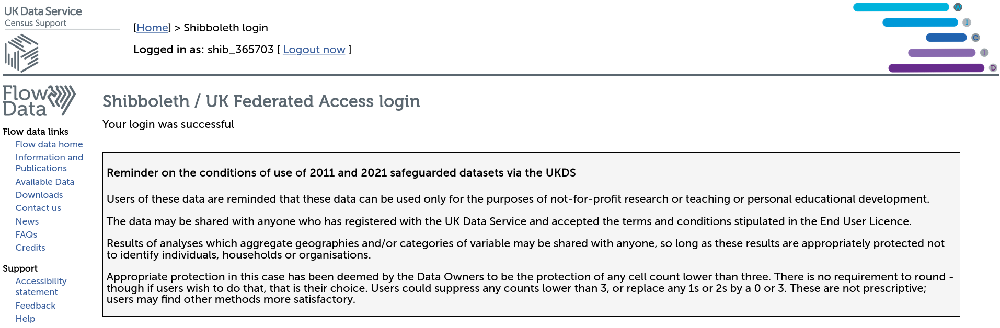
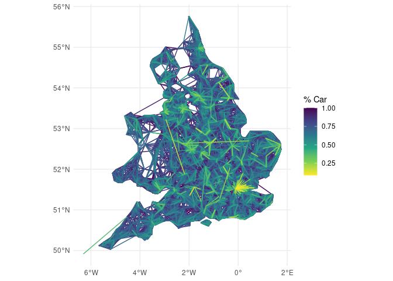

# Getting and using origin-destination data from the 2021 Census in
England for reproducible research
Robin Lovelace

# Pre-requisites

``` r
library(tidyverse)
```

    ── Attaching core tidyverse packages ──────────────────────── tidyverse 2.0.0 ──
    ✔ dplyr     1.1.4     ✔ readr     2.1.5
    ✔ forcats   1.0.0     ✔ stringr   1.5.1
    ✔ ggplot2   3.5.1     ✔ tibble    3.2.1
    ✔ lubridate 1.9.4     ✔ tidyr     1.3.1
    ✔ purrr     1.0.2     
    ── Conflicts ────────────────────────────────────────── tidyverse_conflicts() ──
    ✖ dplyr::filter() masks stats::filter()
    ✖ dplyr::lag()    masks stats::lag()
    ℹ Use the conflicted package (<http://conflicted.r-lib.org/>) to force all conflicts to become errors

# Downloading the data

The datasets are available from WICID:

1.  Click on the Downloads section

2.  Log-in with your institutional credentials, you should then see
    something like this:



3.  Continue and click on the [**2021 Census England & Wales -
    Safeguarded**](https://wicid.ukdataservice.ac.uk/cider/wicid/downloads.php#panel17)
    section, and search for “method of travel”, you should see
    [ODWP02EW_MSOA](https://wicid.ukdataservice.ac.uk/cider/wicid/downloads.php#)
    as an option.
4.  Click on the download button and put the .zip file in the working
    directory of your project.

# Importing and cleaning the OD data

5.  Run the following command to read-in the file:

``` r
# Check you have the right file
list.files(pattern = "zip") 
```

    [1] "ODWP02EW_MSOA_v1.zip"

``` r
od_2021 = read_csv("ODWP02EW_MSOA_v1.zip")
```

    Rows: 3287388 Columns: 7
    ── Column specification ────────────────────────────────────────────────────────
    Delimiter: ","
    chr (5): Middle layer Super Output Areas code, Middle layer Super Output Are...
    dbl (2): Method used to travel to workplace (12 categories) code, Count

    ℹ Use `spec()` to retrieve the full column specification for this data.
    ℹ Specify the column types or set `show_col_types = FALSE` to quiet this message.

``` r
# names(od_2021)
# [1] "Middle layer Super Output Areas code"                    
# [2] "Middle layer Super Output Areas label"                   
# [3] "MSOA of workplace code"                                  
# [4] "MSOA of workplace label"                                 
# [5] "Method used to travel to workplace (12 categories) code" 
# [6] "Method used to travel to workplace (12 categories) label"
# [7] "Count"
# Clean the column names
# Keep only the columns we need:
od_2021 = od_2021[c(1, 3, 6, 7)]
names(od_2021) = c(
  "o",
  "d",
  "method",
  "count"
)
# od_2021 |>
#   group_by(method) |>
#   summarise(n = sum(count))
# # A tibble: 12 × 2
#    method                                              n
#    <chr>                                           <dbl>
#  1 Bicycle                                        569068
#  2 Bus, minibus or coach                         1160957
#  3 Driving a car or van                         12524712
#  4 Motorcycle, scooter or moped                   128524
#  5 Not in employment or aged 15 years and under 20792674
#  6 On foot                                       2113300
#  7 Other method of travel to work                 285653
#  8 Passenger in a car or van                     1083220
#  9 Taxi                                           200289
# 10 Train                                          528653
# 11 Underground, metro, light rail, tram           505001
# 12 Work mainly at or from home                   8671774
# Shorten the method names
od_2021 = od_2021 |>
  filter(!str_detect(method, "Not in employment")) |>
  mutate(
    method = case_when(
      method == "Bus, minibus or coach" ~ "Bus",
      method == "Driving a car or van" ~ "Car",
      method == "Motorcycle, scooter or moped" ~ "Motorcycle",
      method == "On foot" ~ "Walking",
      method == "Other method of travel to work" ~ "Other",
      method == "Passenger in a car or van" ~ "Passenger",
      method == "Underground, metro, light rail, tram" ~ "Metro",
      method == "Work mainly at or from home" ~ "Home",
      TRUE ~ method
    )
  )
od_2021_wide = od_2021 |>
  pivot_wider(names_from = method, values_from = count, values_fill = 0)
od_2021_wide |>
  head() |>
  knitr::kable()
```

| o | d | Metro | Train | Bus | Taxi | Car | Passenger | Bicycle | Walking | Other | Home | Motorcycle |
|:---|:---|---:|---:|---:|---:|---:|---:|---:|---:|---:|---:|---:|
| E02000001 | 999999999 | 4 | 1 | 5 | 1 | 11 | 1 | 1 | 10 | 1 | 0 | 0 |
| E02000001 | E02000001 | 83 | 19 | 34 | 8 | 35 | 8 | 60 | 418 | 37 | 3602 | 5 |
| E02000001 | E02000016 | 0 | 0 | 2 | 0 | 0 | 0 | 0 | 0 | 0 | 0 | 0 |
| E02000001 | E02000024 | 3 | 0 | 0 | 0 | 0 | 0 | 0 | 0 | 0 | 0 | 0 |
| E02000001 | E02000027 | 1 | 0 | 0 | 0 | 0 | 0 | 0 | 0 | 0 | 0 | 0 |
| E02000001 | E02000055 | 0 | 0 | 1 | 0 | 0 | 0 | 0 | 0 | 0 | 0 | 0 |

# Getting the zone dataset

You can get MSOA boundary datasets from a few different sources.

``` r
u_msoa_2021 = "https://services1.arcgis.com/ESMARspQHYMw9BZ9/arcgis/rest/services/Middle_Super_Output_Areas_DEC_2021_EW_PWC/FeatureServer/0/query?outFields=*&where=1%3D1&f=geojson"
msoas = sf::read_sf(u_msoa_2021)
# Keep only the id column
msoas = msoas[2]
# % trips by car:
od_2021_wide = od_2021_wide |>
  mutate(
    `% Car` = Car / (Car + Bus + Bicycle + Motorcycle + Walking + Other + Passenger + Metro + Taxi + Train + Home)
  )
od_2021_sf = od::od_to_sf(od_2021_wide, msoas)
```

    0 origins with no match in zone ids

    20304 destinations with no match in zone ids

     points not in od data removed.

``` r
od_2021_sf$length = sf::st_length(od_2021_sf) |> as.numeric()
od_2021_sf |>
  filter(Car > 10 & length > 10 * 1000) |>
  arrange(desc(`% Car`)) |>
  ggplot() +
  geom_sf(aes(colour = `% Car`)) +
  scale_colour_viridis_c(direction = -1) +
  theme_minimal()
```


